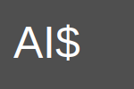

# AI Stablecoin

AI Stablecoin is a decentralized, exogenously collateralized stablecoin pegged to the US Dollar (USD). This project uses OpenZeppelin contracts, Chainlink price feeds, and Foundry smart contract framework. AI Stablecoin allows users to mint stablecoins backed by a collateral ERC20 token.



## Features

- Decentralized stablecoin pegged to USD
- Exogenously collateralized by an ERC20 token
- Chainlink price feeds for accurate and secure price information
- Built using Foundry smart contract framework and Solidity

## Setup

### Dependencies

1. [Foundry](https://foundry.paradigm.xyz/) smart contract framework

### Installation

1. Clone this repository:

```bash
git clone https://github.com/yourusername/ai-stablecoin.git
```

2. Change into the project directory:

```bash
cd ai-stablecoin
```


## Testing

To test the AI Stablecoin contract, run the following command in the project directory:


## Deployment

To deploy the AI Stablecoin contract, you can follow the Foundry smart contract framework's deployment guide.

## Contributing

We welcome contributions from the community! Feel free to open issues or submit pull requests to improve AI Stablecoin.

## License

AI Stablecoin is released under the [MIT License](./LICENSE).
